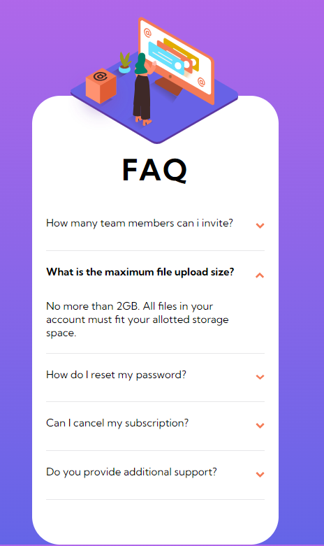
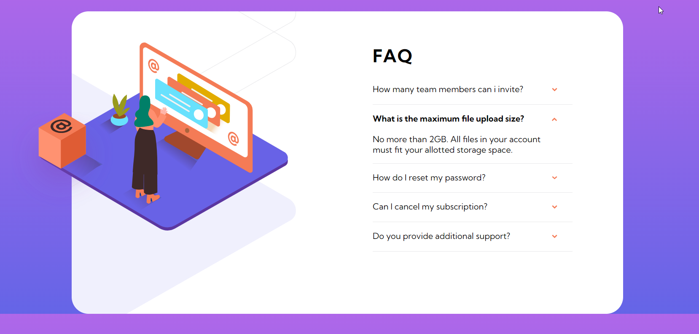

# Frontend Mentor - FAQ accordion card solution

This is a solution to the [FAQ accordion card challenge on Frontend Mentor](https://www.frontendmentor.io/challenges/faq-accordion-card-XlyjD0Oam). Frontend Mentor challenges help you improve your coding skills by building realistic projects. 

## Table of contents
**
- [Overview](#overview)
  - [The challenge](#the-challenge)
  - [Links](#links)
- [My process](#my-process)
  - [Built with](#built-with)
  - [What I learned](#what-i-learned)
  - [Screenshoots](#screenshots)
  - [Continued development](#continued-development)
  - [Useful resources](#useful-resources)
- [Author](#author)
**


## Overview

### The challenge

Users should be able to:

- View the optimal layout for the component depending on their device's screen size
- See hover states for all interactive elements on the page
- Hide/Show the answer to a question when the question is clicked

### Links

- Solution URL: [Add solution URL here](https://your-solution-url.com)
- Live Site URL: [Add live site URL here](https://your-live-site-url.com)

## My process

### Built with

- Semantic HTML5 markup
- CSS custom properties
- Flexbox
- CSS Grid
- Simple Javascript code


### What I learned

**I learned using a few method of classList, and i practice using costum CSS properties.**

To see how you can add code snippets, see below:

```js
 if (Q1.classList.contains("question")){
    Q1.classList.remove("question");
    Q1.classList.add("selectedQuestion");
```
### Screenshots


### Continued development

**I want to resolve more Frontend Newbie project, because my CSS using is not perfect, and i want to reduce the time of development.**

### Useful resources

**- [Example resource 1](https://developer.mozilla.org/en-US/docs/Web/API/Element/classList) - This helped me for learn using classList.**


## Author

**- Frontend Mentor - [@Blanchevalen](https://www.frontendmentor.io/profile/blanchevalen)**

*


[def]: image.png
